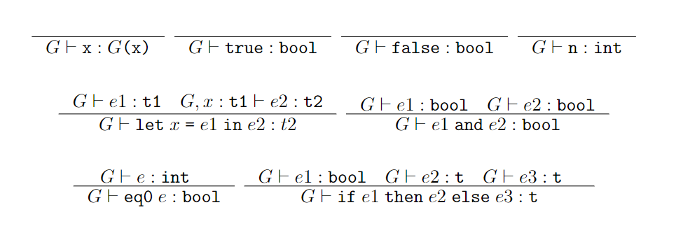

# Discussion 10 - Friday, April 5th

## Reminders

1. Project 4 due **next Tuesday, April 9th @ 11:59 PM**
   1. **⚠️ NO OFFICE HOURS DURING THAT DAY ⚠️** (due to Exam 2)
   2. Last day for project office hours is **Monday**
2. Exam 2 **next Tuesday, April 9th**
   1. Topics list: [@1316](https://piazza.com/class/lrf5qvp042i1y2/post/1316)
   2. TA review session **next Monday, April 8th @ 6PM** in **IRB0324** - [@1340](https://piazza.com/class/lrf5qvp042i1y2/post/1340)

## Exercises

### Operational Semantics

#### Problem 1:

#### Problem 2:

### Type Checking

Using the rules given above, show that the following statements are **well typed**:
1. `eq0 if true then 0 else 1`
2. `let x = 5 in eq0 x and false`

## Additional Readings & Resources

- [Professor Mamat's Type Checking Slides](https://bakalian.cs.umd.edu/assets/slides/19-Typechecking.pdf)
- [Spring 2021 - Operational Semantics Slides](https://www.cs.umd.edu/class/spring2021/cmsc330/lectures/21-semantics.pdf)
- [Fall 2022 - Discussion 10 (Operational Semantics)](https://github.com/umd-cmsc330/fall2022/tree/main/discussions/discussion10#operational-semantics)
