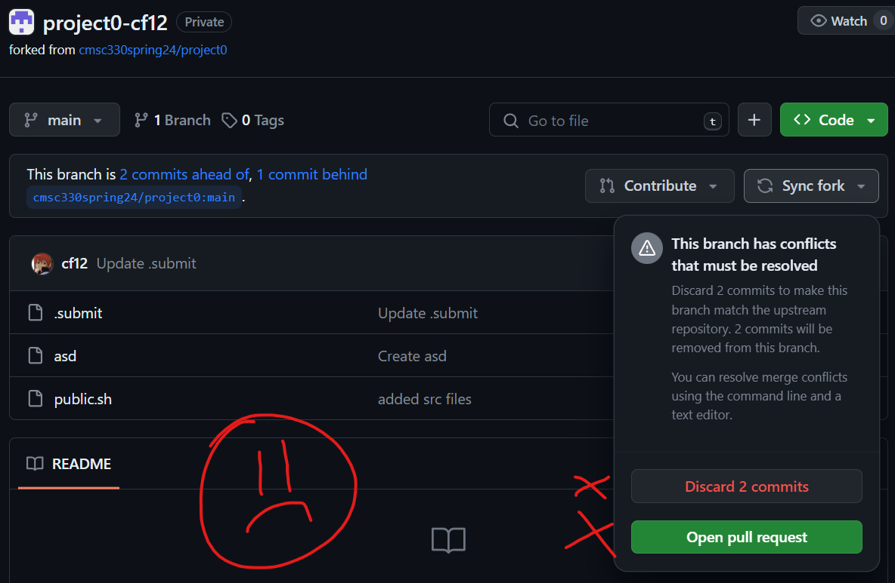

# Discussion 1 - Friday, January 26th

## Reminders

- Project 0 released, due **Wednesday, January 29 @ 11:59 PM**

## Intro to Git

### What is Git?

1. Git is an open-source version control system
2. Make sure to [set up an SSH key](https://github.com/cmsc330spring24/cmsc330spring24/blob/main/projects/project0.md#set-up-ssh-authentication) to securely authenticate yourself (refer to Project 0 for detailed instructions on how to do this).
   - If you are on windows, you will need to install WSL before making the SSH key, you can also find instructions for this in [project 0](https://github.com/cmsc330spring24/cmsc330spring24/blob/main/projects/project0.md#windows)

### Cloning Project Repositories

1. Navigate to Class GitHub (located on the [class page](https://bakalian.cs.umd.edu/330))
1. Under **Project Links**, click on the project you want to initialize (i.e. **Project 0**)
1. Accept the project
1. `git clone git@github.com:cmsc330spring24/<PROJECT_NAME>`
1. Go into your new repository: `cd <PROJECT_NAME>`

### Staging, Committing, and Pushing Changes

1. Make text file in the repository directory on your machine: `touch hello.txt`
2. Add: `git add .` (the `.` after `git add` refers to the entire current directory, you can also add specific files/directories like so: `git add <file.txt>`)
3. Commit: `git commit -m "Add new text file"`
4. Push: `git push`


### Pulling Changes

1. Edit text file on GitHub website (in your browser)
2. Pull: `git pull`

## Syncing with Upstream

Occasionally we'll need to make important changes to a project's specifications and/or update its codebase. We'll make these changes by pushing to an upstream fork repository, which is **not the same repository as your personal GitHub classroom repo.**

As such, it's important to know how to properly sync your own repository with ours. If you aren't able to do this, you might miss out on important project updates and new test cases!

### Updating from GitHub

#### No commits ahead

If your repository is out of date, and you haven't pushed any changes to your repository yet, you'll see a message that looks like the following:


You can sync your repository by clicking on **Sync fork > Update branch** :


#### Commits ahead

More often, you'll probably have commits ahead of the upstream. This can happen when we push out updates in the middle to late stages of a project, and you've already uploaded parts of your solution. In these cases, your repo will look something like this:


Click on **Sync fork**. If the popup shows that you are able to **Update branch**, then you can click on that to safely merge your commits with our upstream changes:


If you see the **Open pull request** button however, this means that your changes cannot be merged cleanly, and you'll have to resolve the merge conflicts manually in git:



If this is the case, follow the instructions below in [Updating from Command Line](#updating-from-command-line)

> **⚠️ WARNING:** Never click the **Discard X commits** button! This will permanently delete your work!

### Updating from Command Line

If GitHub is unable to automatically merge your commit changes, you'll have to add the upstream remote manually and merge our updated changes manually in the git CLI:

1. Clone your personal github classroom repo (if you haven't done so already)
   ```shell
   $ git clone git@github.com:cmsc330spring24/projectX-<username>.git
   $ cd projectX-<username>
   ```
2. Add the upstream remote path
   ```shell
   $ git remote add upstream git@github.com:cmsc330spring24/projectX.git
   ```
3. Pull the upstream commits from `upstream/main`:
   ```shell
   $ git pull upstream main
   ```
4. Resolve merge conflicts (if any)
   1. You can do this directly in VS Code or on the CLI
5. Add, commit, and push your merge commit
   ```shell
   $ git add .
   $ git commit --no-edit
   $ git push origin main
   ```

You should see your merged changes propogate to your github classrooms repo:


## Exercise

Let's practice submitting a simple python program to Gradescope. Note that this assignment is just for practice and doesn't count towards anything:

1. Accept the project on GitHub Classroom: [Link](https://classroom.github.com/a/QqY-hMin)'
2. Clone the project onto your local filesystem (you will need an SSH key set up to do this)
3. Create a file `rectangle.py` with the following contents:
   ```python
   num_rectangles = 0

   class Rectangle:
      def __init__(self, width, height):
         self.width = width
         self.height = height

         global num_rectangles
         num_rectangles += 1

      def get_area(self):
         return self.width * self.height

      def get_num_rectangles():
         return num_rectangles
   ```
4. Submit the project
     - If you have done project 0, you can use the `submit` command as you would have done for the project.
     - If you have not done project 0, for this discussion you will need to submit it manually via Gradescope. First, you will need to link your Gradescope to your GitHub account: Log into Gradescope and go to your account settings. Scroll down to the Linked Accounts section. If you do not already have your GitHub account linked here, click the 'Link a GitHub' account button and log into your GitHub account. Once this is complete, the assignment in Gradescope will have the option to submit using GitHub.
